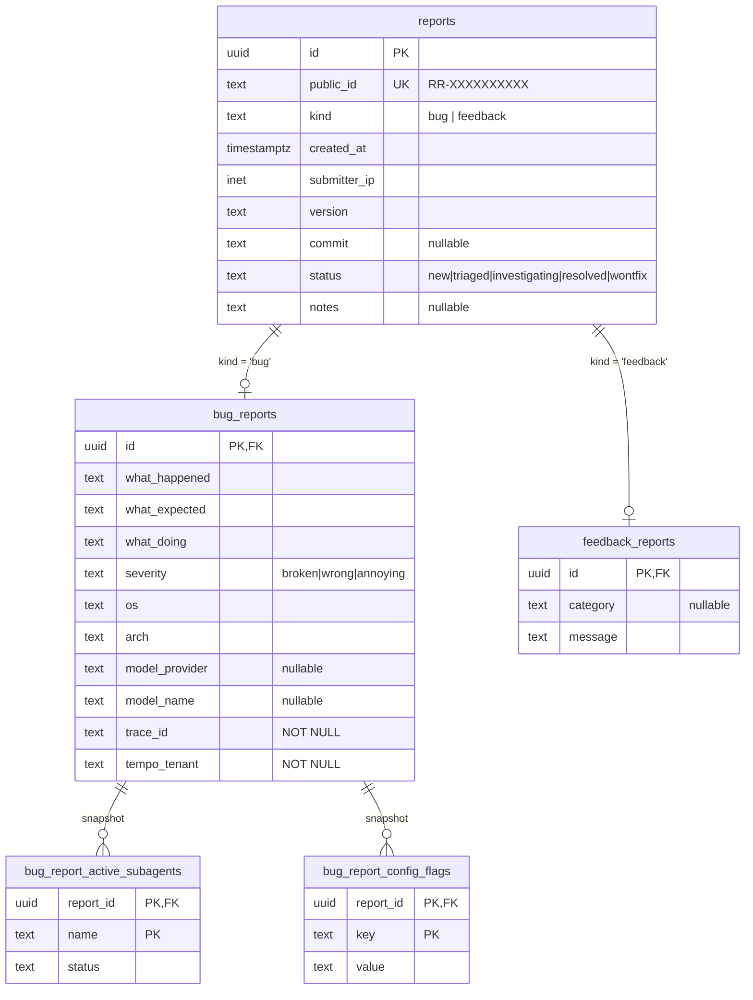

# Residuum Feedback — Database Schema (Archived)

**Archived — this schema is live.** Kept as the design record for the
`feedback-ingest` service's Postgres schema. The authoritative, evolving
copy of this schema lives in the `feedback-ingest` service repo's own
migrations, not here — check there for anything added since this was
written.

Locked spec for the Postgres schema backing the residuum feedback ingestion
feature. See `residuum-feedback-plan.md` for the broader lab-side plan and
the cross-cutting architectural decisions at `~/Projects/residuum-feedback-decisions.md`.

This is a **spec, not a workshop.** The DDL below is committed to and
lands as the first sqlx migration in the `feedback-ingest` service repo
(not in `grizzly-platform`). The `residuum_feedback` database, role, and
connection secret are provisioned separately — see the "Provisioning"
section below.

---

## Purpose

The `feedback-ingest` service stores bug report and feedback submission
metadata in a Postgres database on the lab's existing `r730xd-postgres`
instance. The database is:

- **Dedicated** to the feature — separate from any other lab-data
  database, so backups, versioning, and future migrations move
  independently
- **Normalized** — built to support analysis and investigation tooling,
  not just write-once logging
- **Isolated** on the existing `r730xd-postgres` instance under a new
  database and a scoped role
- **Write-oriented now, query-oriented later** — the first pass is
  write-only from the ingest service, but the schema does not box out
  the read API / investigation UI that'll be built on top

Trace data lives in Tempo under the dedicated `residuum-feedback` tenant.
Postgres stores only metadata, with `trace_id` as the join key back into
Tempo. Only bug reports carry a trace; feedback reports do not.

---

## What is stored

### Shared across both kinds

Every report has:

- Internal report ID — UUID v7 (time-sortable under the hood)
- Public-facing report ID — `RR-` + 10-char Crockford base32, shown to the user
- Kind — `bug` or `feedback`
- Created-at timestamp
- Submitter IP — for rate-limit analytics and abuse detection (**not** for display)
- Residuum version
- Residuum commit (nullable — not every build captures it)
- Triage status — one of `new`, `triaged`, `investigating`, `resolved`, `wontfix`
- Developer notes (nullable; populated during triage, not at submission)

### Bug-report-only

User-typed, always present:

- `what_happened` — required free text
- `what_expected` — required free text
- `what_doing` — required free text
- `severity` — enum: `broken`, `wrong`, `annoying`
  - **`broken`** — crashes or completely unusable features
  - **`wrong`** — does or doesn't do something it should
  - **`annoying`** — slow, visual, or QoL; doesn't affect usability

Client context captured at submission:

- OS (e.g. `linux`, `darwin`, `windows`)
- Arch (e.g. `x86_64`, `aarch64`)
- Model provider (e.g. `anthropic`) — nullable
- Model name (e.g. `claude-opus-4-6`) — nullable

Trace join keys (**required** — every bug report arrives with a trace,
or the submission is rejected at input validation):

- `trace_id` — Tempo trace ID for the submission
- `tempo_tenant` — always `residuum-feedback` at insert time; stored as
  a plain column so a future tenant rename is a data migration, not a
  schema one

Variable-arity snapshots:

- **Active subagents** — zero-to-many `{name, status}` entries,
  per-report, never updated after submission
- **Config flags** — zero-to-many `{key, value}` entries from a
  pre-curated allowlist of configuration toggles, per-report, never
  updated

### Feedback-only

- `message` — required free text
- `category` — nullable free text or short enum

Feedback carries **no** client-context fields beyond the shared
`version` on the parent, and **no** trace. No OS, no arch, no subagent
snapshot, no config flags, no `trace_id`. This is intentional —
feedback is low-overhead by design. "This thing is confusing" doesn't
need a full data dump, and there is nothing in Tempo to investigate.

### Explicitly NOT stored

The schema has no columns for any of these, and shouldn't grow them
later without a deliberate decision:

- Chat history, conversation turns, agent transcripts
- Memory or file contents
- API keys, tokens, credentials of any kind
- File paths or directory listings
- Anything derived from the user's disk state

These are excluded at the client (residuum) layer before the payload is
ever sent. Sanitization of the attached span dump is forced-on
regardless of the user's global sanitize setting; free-text fields the
user typed themselves are not redacted (users are responsible for
keeping PII out of what they write).

---

## Design goals

1. **Normalized.** No JSONB catch-all columns for structured data.
   Variable-arity snapshots (subagents, config flags) live in their own
   tables.
2. **Class-table inheritance.** One parent `reports` table for shared
   identity; separate child tables for the kind-specific shape. The
   parent's `kind` column is authoritative.
3. **Queryable from day one.** Indexes that support the future
   investigation tooling: list by kind, filter by status, look up by
   public ID, trace ID.
4. **Cascades on delete.** Deleting a parent report cleans up all
   children in one statement.
5. **Postgres-native constraints.** `CHECK` constraints on enum-shaped
   columns rather than PG `ENUM` types, so adding a new value is a
   simple DDL change.
6. **Forward-compatible.** The read API is deferred, but the schema
   does not paint us into a corner.

---

## Shape



Class-table inheritance: `reports` carries shared identity and triage
state; `bug_reports` / `feedback_reports` carry the kind-specific shape;
the two snapshot tables hang off `bug_reports` only. Cascades run
through `reports.id` so `DELETE FROM reports WHERE id = …` cleans
everything up.

---

## Final DDL

Destination: `feedback-ingest` service repo, `migrations/0001_init.sql`
(or whatever numbering sqlx expects). Not grizzly-platform.

```sql
-- Parent: shared identity + triage state
CREATE TABLE reports (
  id              uuid        PRIMARY KEY,            -- UUID v7 (service-generated)
  public_id       text        NOT NULL UNIQUE
                    CHECK (public_id ~ '^RR-[0-9A-HJKMNP-TV-Z]{10}$'),
  kind            text        NOT NULL
                    CHECK (kind IN ('bug', 'feedback')),
  created_at      timestamptz NOT NULL DEFAULT now(),
  submitter_ip    inet,
  version         text        NOT NULL,
  commit          text,
  status          text        NOT NULL DEFAULT 'new'
                    CHECK (status IN ('new','triaged','investigating','resolved','wontfix')),
  notes           text
);

-- Bug-only: user-typed fields + inline client context + trace join key
CREATE TABLE bug_reports (
  report_id       uuid        PRIMARY KEY
                    REFERENCES reports(id) ON DELETE CASCADE,
  what_happened   text        NOT NULL,
  what_expected   text        NOT NULL,
  what_doing      text        NOT NULL,
  severity        text        NOT NULL
                    CHECK (severity IN ('broken','wrong','annoying')),
  os              text        NOT NULL,
  arch            text        NOT NULL,
  model_provider  text,
  model_name      text,
  trace_id        text        NOT NULL,
  tempo_tenant    text        NOT NULL
);

-- Bug-only: variable-arity subagent snapshot (FK targets bug_reports so
-- these rows can only exist for bug-kind reports)
CREATE TABLE bug_report_active_subagents (
  report_id  uuid NOT NULL
               REFERENCES bug_reports(report_id) ON DELETE CASCADE,
  name       text NOT NULL,
  status     text NOT NULL,
  PRIMARY KEY (report_id, name)
);

-- Bug-only: variable-arity config toggle snapshot
CREATE TABLE bug_report_config_flags (
  report_id  uuid NOT NULL
               REFERENCES bug_reports(report_id) ON DELETE CASCADE,
  key        text NOT NULL,
  value      text NOT NULL,
  PRIMARY KEY (report_id, key)
);

-- Feedback-only: minimal
CREATE TABLE feedback_reports (
  report_id  uuid PRIMARY KEY
               REFERENCES reports(id) ON DELETE CASCADE,
  category   text,
  message    text NOT NULL
);

-- Indexes: list/filter for the investigation tooling
CREATE INDEX reports_created_at_idx
          ON reports (created_at DESC);
CREATE INDEX reports_kind_created_idx
          ON reports (kind, created_at DESC);
CREATE INDEX reports_status_idx
          ON reports (status);

CREATE INDEX bug_reports_severity_idx
          ON bug_reports (severity);
CREATE INDEX bug_reports_trace_id_idx
          ON bug_reports (trace_id);

-- Reverse-lookup indexes on snapshot tables
CREATE INDEX bug_report_active_subagents_name_idx
          ON bug_report_active_subagents (name);
CREATE INDEX bug_report_config_flags_key_idx
          ON bug_report_config_flags (key);
```

### Notes on the DDL

- **`public_id` is a dedicated column**, not derived at query time.
  Stable, indexable, rotatable independently of the internal UUID. The
  regex CHECK enforces the Crockford base32 alphabet (no `I`, `L`, `O`,
  `U`) and `RR-` prefix at the DB level.
- **Client context is inline on `bug_reports`**, not a separate
  `bug_client_context` table. A 1:1 split would be pure normalization
  ritual with no integrity or lifecycle benefit.
- **`feedback_reports` has only three columns.** Everything else
  feedback needs (version, created_at, status) lives on the parent.
- **`CHECK` constraints instead of PG `ENUM`** — adding a new severity
  or status is a column-level migration, not an `ALTER TYPE` dance.
- **Snapshot FKs target `bug_reports(report_id)`, not `reports(id)`.**
  Same cascade behavior (the FK chain still reaches the parent), but
  this makes it impossible to attach subagents or config-flags to a
  feedback-kind report — the integrity constraint matches the intent.
- **`bug_reports.trace_id` is NOT NULL**, so the index is plain (no
  partial `WHERE trace_id IS NOT NULL` qualifier needed).

---

## Locked decisions

Answers to the open questions from the workshop phase:

| # | Question | Decision | Why |
|---|---|---|---|
| 1 | Database name | `residuum_feedback` | Match K8s namespace / DNS / service name / Tempo tenant. Underscores for the PG identifier. |
| 2 | Snapshots: tables or JSONB? | **Tables** (as specified above) | Investigation tooling is the entire point. Design goal #1 already forbids JSONB catch-alls. Queryability > insert speed for a write-once workload. |
| 3 | Third variable-arity child table? | **Not yet.** Ship subagents + config_flags only. | The residuum-side allowlist for auto-attach data is still TBD. Adding a third child table later is an additive migration — don't speculate. |
| 4 | Retention policy | **Indefinite in first pass.** `trace_id` may dangle after 30 days (Tempo's `720h` block retention) and that's acceptable. | Metadata is cheap; long-term trends are the investigation use case. A purge/rotation job is a later decision. Document the dangling-trace expectation in the service repo's README. |
| 5 | Reverse indexes on snapshot tables | **Yes** — `(name)` and `(key)` (included in the DDL above). | Enables "which reports had subagent X active" / "which reports had flag Y set" without a seq scan. Tables are write-once so index maintenance cost is negligible. |
| 6 | Audit trail on `status` / `notes` | **None in first pass.** Current state only. | Audit is an additive migration later — a `report_status_history` table with an FK to `reports(id)` doesn't break anything existing. |
| 7 | `submitter_ip` retention | **Store raw.** Retention pass is a follow-up open question for the service repo, not the schema. | Hashing at insertion breaks the abuse-forensics use case (can't correlate across IPs). Dropping kills rate-limit analytics. Raw + a documented retention pass later is the only option that keeps both use cases alive. The column stays `inet`. |
| 8 | Migrations toolchain | **`sqlx migrate`**, run on service startup. | Matches the relay. Not a grizzly-platform concern — migrations live in `feedback-ingest`'s own repo. |
| 9 | Seed / fixture data | **None.** Empty migrations; local dev gets an empty DB. | No bootstrap rows needed. A test fixture helper in the service repo is a separate concern. |

---

## Provisioning

**Live as of 2026-04-15.** The `residuum_feedback` database and owning
role exist on the `r730xd-postgres` instance. The schema migration in
this doc has been applied via `sqlx::migrate!()` on feedback-ingest
startup and all tables + indexes are present.

**Provisioning is NOT a grizzly-platform concern** — it moved to the
feedback-ingest repo during the discovery discussion. The rationale is
keeping grizzly-platform free of per-app logic: grizzly-platform owns the PG instance
(`r730xd-postgres` role) and the superuser credential in Ansible Vault
(`vault_postgres_password`), and that's its only touchpoint for this
feature's database. Everything downstream — creating the app DB,
creating the owning role, rotating the role password, applying DDL —
lives with the code that depends on it.

The concrete flow:

- **Schema evolution:** `feedback-ingest/migrations/*.sql` run via
  `sqlx::migrate!()` at service startup. No out-of-band Ansible step.
- **DB + role bring-up:**
  `feedback-ingest/.github/workflows/bootstrap-db.yml` is a
  `workflow_dispatch` job on the self-hosted lab runner. It runs
  `scripts/bootstrap-db.sh`, which uses standard libpq env vars
  (`PGHOST=10.0.0.200 PGPORT=5432 PGUSER=postgres`) and the
  `PG_SUPERUSER_PASSWORD` gh secret to issue idempotent `CREATE
  DATABASE` / `CREATE ROLE` against r730xd. Re-running rotates the
  role password.
- **Credential handoff:** the feedback-ingest repo holds four gh
  secrets populated by `scripts/setup-gh-secrets.sh` —
  `FEEDBACK_UPSTREAM_TOKEN`, `PG_SUPERUSER_PASSWORD`,
  `FEEDBACK_DB_PASSWORD`, and a composed `DATABASE_URL`. The setup
  script also writes a matching local `.env` so the password is
  generated once client-side and pushed identically to both
  destinations, avoiding the "gh secrets are write-only" readback
  problem.

What grizzly-platform still needs to own:

- Keeping `vault_postgres_password` in
  `ansible/inventory/group_vars/all/vault.yml` current. When it
  rotates, the operator re-runs `setup-gh-secrets.sh` in the
  feedback-ingest repo to sync the new value into `PG_SUPERUSER_PASSWORD`.
- Ensuring `r730xd-postgres` continues to accept TCP connections from
  the self-hosted lab runner (already true).

When the K8s manifests land, the `FEEDBACK_DATABASE_URL` gh secret
gets wired into a SealedSecret / Sealed K8s Secret in
`kubernetes/apps/residuum-feedback/` — that's the one remaining
grizzly-platform touchpoint for this database.

---

## Things that are NOT open

Locked by decisions already made elsewhere:

- The two kinds (`bug`, `feedback`) and their distinct shape
- The required fields on bug reports (`what_happened`, `what_expected`, `what_doing`, `severity`)
- The feedback minimalism (message + optional category + version only)
- The `RR-XXXXXXXXXX` public ID format
- The `residuum-feedback` Tempo tenant name
- The exclusion of chat history, memory, file contents, secrets from any column
- The choice to run on the existing `r730xd-postgres` instance (not a separate PG server)
- Storage isolation: dedicated database, not a schema inside an existing database

---

## Verification

The schema doesn't land in grizzly-platform, so there's nothing to verify in
this repo. When the DDL is committed in the `feedback-ingest` service
repo, validate with:

1. **Fresh DB apply.** `docker run --rm postgres:16` + `sqlx migrate run`
   against a throwaway database — migrations must apply cleanly on an
   empty PG 16.
2. **Sample inserts.** One bug report with two subagents and three
   config flags; one feedback report. Assert the public_id CHECK
   rejects `'BAD-XXXXXXXXXX'` and accepts `'RR-0123456789'`.
3. **Cascade delete.** `DELETE FROM reports WHERE id = …` for the bug
   report; assert `bug_reports`, `bug_report_active_subagents`, and
   `bug_report_config_flags` are all empty for that id.
4. **FK integrity.** Attempt to insert a `bug_report_active_subagents`
   row for a feedback-kind report's id — must fail with a FK
   violation.
5. **NOT NULL on trace columns.** Attempt to insert a `bug_reports`
   row with `trace_id = NULL` or `tempo_tenant = NULL` — must fail
   with a not-null violation. A `feedback_reports` insert succeeds
   even though there is no trace column to populate.
6. **Severity constraint.** Insert a `bug_reports` row with
   `severity = 'crash'` — must fail with a CHECK violation.
   `severity = 'broken'` succeeds.
7. **Index presence.** `\di` shows all seven explicit indexes plus the
   automatic PK/UNIQUE backings.

None of these require grizzly-platform or the r730xd PG instance — they run
against a local container while the service repo's test harness is
being written.
